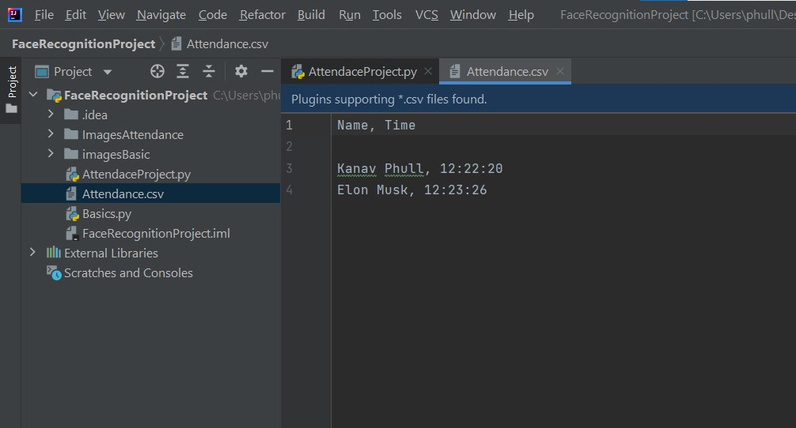

# face-recognition-and-attendance
Face Recognition and Attendance Project

The Following Python Packages are used :
- face_recognition, 
- numpy, 
- opencv-python

The face_recognition library developed by Adam Geitgey is used. To properly understand what goes on in the backend of the library, visit this
<a href="https://medium.com/@ageitgey/machine-learning-is-fun-part-4-modern-face-recognition-with-deep-learning-c3cffc121d78">blog</a>.

Face recognition is a series of several problems:
First, look at a picture and find all the faces in it.  
Second, focus on each face and be able to understand that even if a face is turned in a weird direction or in bad lighting, it is still the same person.  
Third, be able to pick out unique features of the face that you can use to tell it apart from other people— like how big the eyes are, how long the face is, etc.  
Finally, compare the unique features of that face to all the people you already know to determine the person’s name.

This IDE used is IntelliJ IDEA.  
The script is able to detect multiple faces at a time. 
Here is a screenshot of the running project: 
  

The ImagesAttendance Folder contains the database for attendance marking (all the known faces whose attendance will be marked!) 
Attendance.csv file contains the attendance. 
  

Basics.py is for demonstration purposes only! It recognises the face and prints the Name of the person detected in terminal. The images used for this python file are in imagesBasic Folder.  

AttendaceProject.py is the main project file which uses the database in ImagesAttendance Folder.  
 
To Run the script in your system, simply download the entire project folder in your system, install the required python libraries along with their dependencies and simply run the 'AttendaceProject.py' script.
